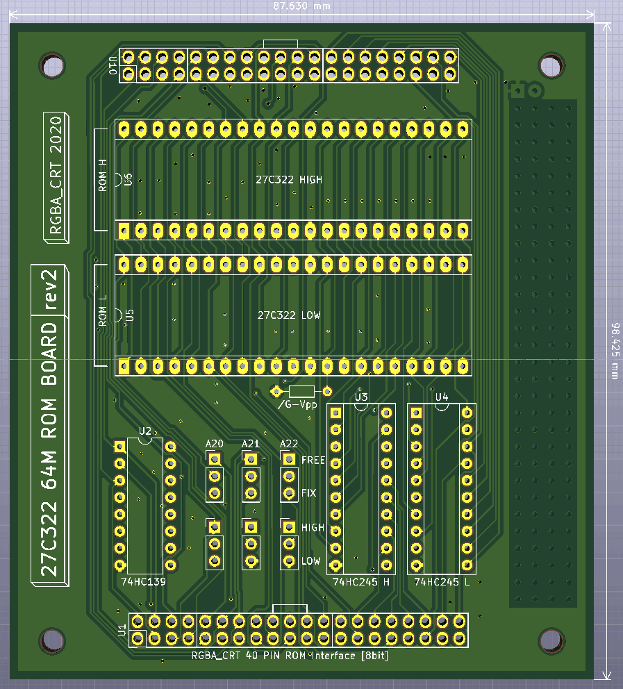
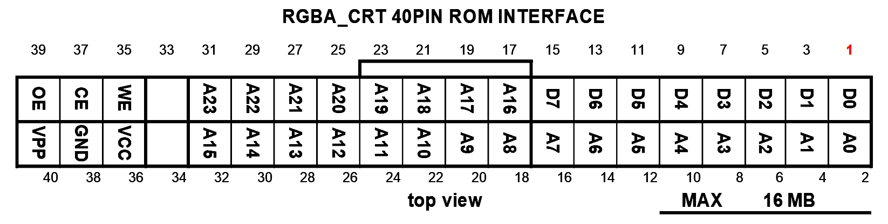
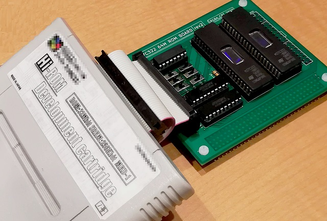
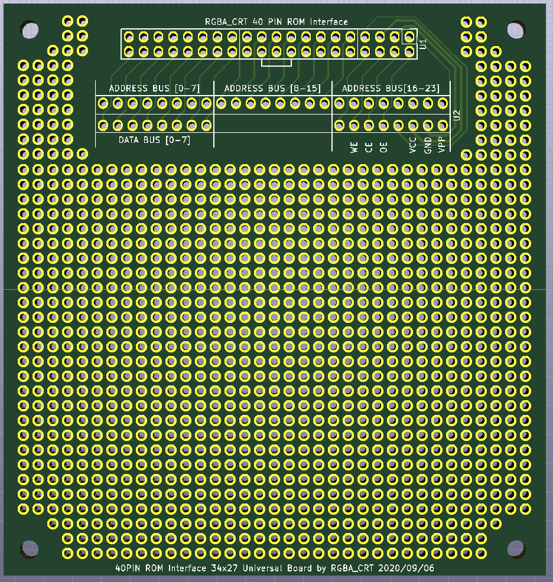

# RGBA_CRT ROM BOARD
+ 27C322 64Mbit ROM board for 8bit databus system
**※まだ不安定です**

# about
+ 27C322を40ピンのピンヘッダに引き出す基板です
+ レトロコンシューマゲーム機やレトロコンピュータでの使用を想定しています
+ 引き出したピンヘッダにはIDC 40ピンリボンケーブルを接続します
	+ IDEケーブル（40芯, 全ピンが結線されているもの）が使用可能です
+ その他
	+ データバスは8bitに変換されます
	+ 27C322を2つ使って64Mbitに対応
	+ ROMのセレクトスイッチ搭載
+ この基板に対応したROMライターはこちら
	+ https://github.com/RGBA-CRT/FT232H-EPROM-Prog

# PIN ROM Interface pinout

+ data bus: 8bit
+ address bus: A0-A23 24bit
+ control bus: CE / OE / WE
+ VPP signal supported

# ROM select switch
+ A20, A21, A22の制御スイッチがあります
	+ A20 ... 8Mbit単位切り替え
	+ A21 ... 16Mbit単位切り替え
	+ A22 ... 32Mbit単位切り替え（EPROM切り替え）
+ FREEにするとそのアドレスビットの制御を機器側に委ねます
+ FIXにするとそのアドレスビットの制御をHIGH/LOWスイッチに委ねます
+ 使用例
	+ 1つの64MbitのROMとして基板を使いたい
		+ A20, A21, A22をすべてFREEにする
	+ 4つの16MbitのROMとして基板を使いたい
		+ A20をFREEにする
		+ A21, A22はFIXにする
			+ 2つのHIGH/LOWスイッチで4分割したROMの選択を行う

# 使用例

# other
+ SNES/SFCのExHiROMとして使用する場合は、ROM焼き時と実機実行時でROM L, ROM Hを逆に取り付ける必要があります。
	+ ROMライターはファイルの順の通り次のように書き込みます
		+ ROM L: SNES BANK $C0-$FF
		+ ROM H: SNES BANK $40-$7F
	+ したがってSFCのカートリッジとして使うときにはROM LとROM Hを逆にする必要があります
+ おまけ
	+ この40 PIN ROM Interfaceに対応したユニバーサル基板
	
